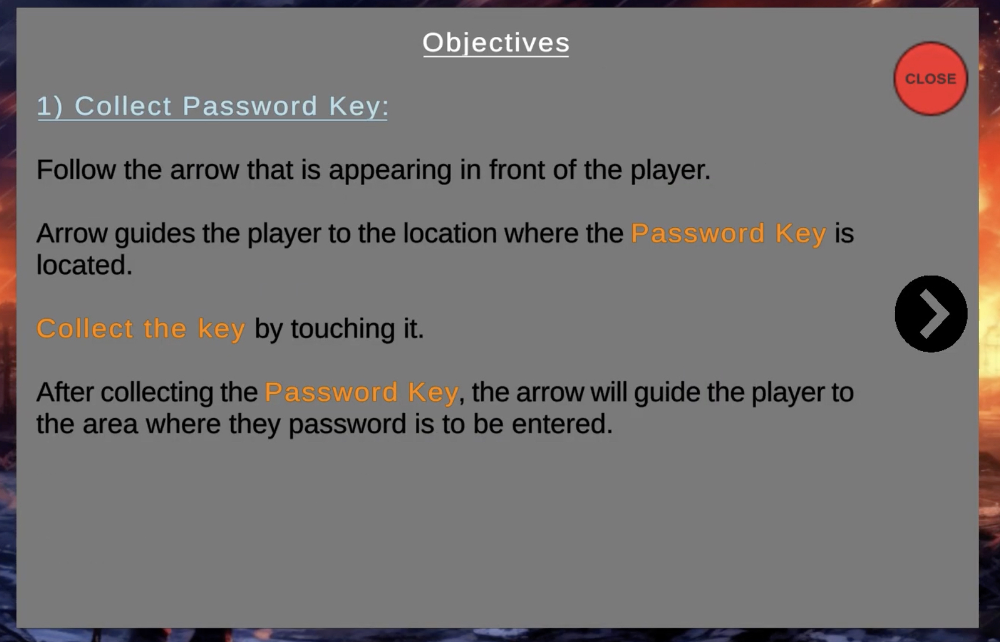

Video Recording: https://drive.google.com/file/d/1UXdHGc7q_uXHqP7yu5EFQoT97TZ1bIhS/view?usp=sharing

# Unity 3D First-Person Shooter Game Documentation

## Introduction
This document details my Unity 3D First-Person Shooter (FPS) game, designed for our team project. The game surrounds from mountainous terrain to urban settings which remsemble a highly secured facility, challenging players with dynamic combat mechanics and strategic navigation.

## Game Overview
Players start their journey in a mountainous area, proceed through urban environments, and infiltrate a secured facility. Gameplay involves navigating these diverse settings, managing combat encounters with intelligent enemies, and utilizing various weapons and tactical maneuvers.

## Gameplay Mechanics
- **Movement**: Players navigate using WASD keys.
- **Weapons**: Players are equipped with:
  - **Pistol**: A precision firearm with slow firing.
  - **Machine Gun**: A rapid-fire long-range weapon.
- **Reloading**: The player can load the ammo by pressing "R" from the keyboard when ammo runs out.
- **Objectives**: Players must find keys to unlock new areas and complete objectives.

## Game Intstructions Images

## Combat and Interaction
Enemies patrol predetermined paths but will chase the player upon detection. If players evade detection, enemies search the vicinity before resuming their patrol. The game integrates a health and shield system where the shield absorbs most damage until depleted, then health points are directly affected.

## User Interface (HUD)
The HUD is designed for clarity and constant feedback:
- **Health and Shield Status**: Prominently displayed at all times. (health = red bar, shield = blue bar) 
- **Ammunition Levels and Weapon Type**: Constantly visible on-screen.
- **Objective Indicator**: An Arrow is implemented to direct players to their next target.

## Technical Challenges
Developing the game's AI presented challenges, especially in enemy behavior and interaction dynamics. Solutions included:
- **AI Behavior**: Refined using Unity's NavMesh for realistic patrols.
- **Dynamic Waypoint System**: Updates dynamically based on player actions.
- **Interactive Elements**: Implemented Unity’s raycasting for key interactions and door unlocking.

## General Game Components and Features
Key game features:
- **Player Mechanics**: Detailed shooting and interaction capabilities.
- **Strategic Elements**: Includes key collections and terminal interactions for area unlocking.

## Sound and Graphics
The game features comprehensive sound design to enhance immersion, including effects for shooting, jumping, and enemy alerts. Visuals are crafted using Unity's rendering methods to support gameplay mechanics and provide a realistic environment.

## Endgame and Replayability
Upon depleting all health, players see a 'Game Over' screen with options to restart the level, encouraging gameplay refinement and strategy development.

## Conclusion
Developing this Unity 3D FPS game has been a comprehensive educational experience, emphasizing the practical application of game design theories. It enhanced my technical skills, problem-solving capabilities, and creative thinking.

## Key Features of the game 
- The game begins in a mountainous area, progresses through urban environments, and concludes in a highly secured facility, satisfying the scenario setup.
- The game features a pistol for slow, precise shots and a machine gun for long-range, rapid fire, fulfilling the weapons requirement.
- Players have both a life bar and a shield bar. The shield takes most of the damage until depleted, after which health takes full damage, in line with the specifications.
- The HUD consistently displays life, shield status, weapon type, and ammunition, ensuring players are always aware of their stats.
- Doors in the game cannot be opened without the appropriate key, aligning with the game mechanics specified.
- Enemies patrol set paths and will engage the player upon detection. If the player evades detection after being noticed, enemies search the area, which satisfies the enemy behavior criteria.
- The game includes comprehensive sound effects for movements, item pickups, combat, and interactions like opening doors, meeting the sound-tracking requirement.
- A game over screen is presented when the player loses all health, with the option to restart the level, fulfilling the end-game condition.

Bonus 

- 'Life', 'shield', and 'ammo' items are scattered across the stage for players when defeated the enemies. 

## Further Improvments: 

1) Advanced AI Behaviors: I'm thinking of implementing more complex enemy AI behaviors, such as the ability for enemies to take cover or call for reinforcements when outnumbered. This would make combat scenarios more challenging and realistic, requiring players to use more strategic thinking and tactics. Additionally, adding patrol variations and conditional responses based on player actions (like setting off alarms) can increase the depth of gameplay.

2) Expanded Arsenal and Customization: I would also like to introduce a broader range of weapons and customizable options. This could include melee weapons, grenades, and special gadgets like drones for scouting. Each weapon could have various upgrades and customizations, such as scopes, extended magazines, or different ammunition types (e.g., incendiary or explosive bullets). Allowing players to tailor their loadouts to their play style would add an extra layer of strategy and personalization to the game.

3) Interactive Environments: I think it would be better if I could enhance the game's environments to be more interactive and destructible. Players could use the environment strategically, such as shooting down chandeliers to disrupt enemy forces or breaking through walls to create new pathways. Adding environmental hazards, such as explosive barrels or unstable structures, can also provide more dynamic combat options.
